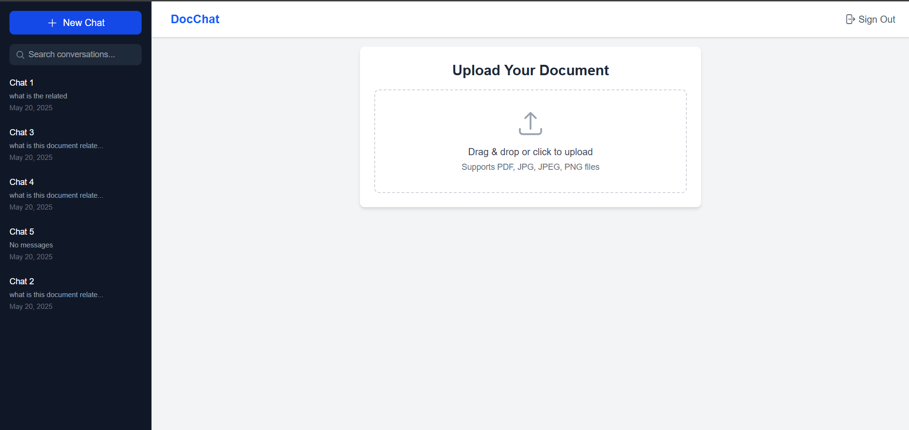
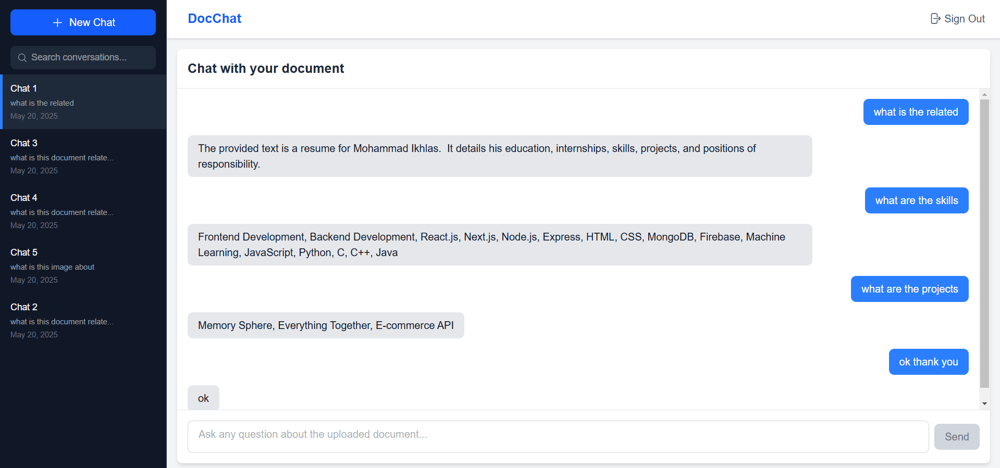

# 🤖 DocChat – Chat with Your Documents
---

# Live Link
- https://doc-chat-kappa.vercel.app/

Overview

Chatbot App ("DocChat") is a web application that allows users to upload documents (PDF, JPG, PNG) and chat with an AI to extract information from the uploaded documents. The app is built using Next.js for the frontend, Firebase for authentication and database storage, and integrates with the Google Generative AI API for natural language processing. The app features a responsive UI with a sidebar for chat history, a document upload interface, and a chat window for interacting with the AI.

---

## ✨ Features

- 📁 **Document Upload**: Upload PDF, JPG, or PNG files to get started.
- 💬 **AI-Powered Chat**: Ask questions about your document and get intelligent responses using the **Google Generative AI API**.
- 🕑 **Chat History**: Access and switch between past conversations from a dedicated sidebar.
- 📱 **Responsive Design**: Clean and adaptive layout optimized for both desktop and mobile use.
- 🔐 **Authentication**: Secure sign-up and login using **Firebase Authentication**.

---

## Setup Instructions

# 1. Clone the Repository
If you haven’t already set up a GitHub repository, follow the instructions in the "GitHub Repository Setup" section below. Otherwise, clone the repository:
git clone <repository-url>
cd CHATBOT-APP

# 2. Install Dependencies
Install the required dependencies using npm:
npm install

# 3. Configure Environment Variables
Create a .env.local file in the root directory and add the following environment variables:
- NEXT_PUBLIC_GOOGLE_GENERATIVE_AI_API_KEY=<your-google-generative-ai-api-key>
- NEXT_PUBLIC_FIREBASE_API_KEY=<your-firebase-api-key>
- NEXT_PUBLIC_FIREBASE_AUTH_DOMAIN=<your-firebase-auth-domain>
- NEXT_PUBLIC_FIREBASE_PROJECT_ID=<your-firebase-project-id>
- NEXT_PUBLIC_FIREBASE_STORAGE_BUCKET=<your-firebase-storage-bucket>
- NEXT_PUBLIC_FIREBASE_MESSAGING_SENDER_ID=<your-firebase-messaging-sender-id>
- NEXT_PUBLIC_FIREBASE_APP_ID=<your-firebase-app-id>

Replace <your-...> with the actual values from your Firebase project and Google Cloud Console.
Ensure .env.local is added to .gitignore to avoid committing sensitive information.

# 4. Run the Development Server
Start the Next.js development server:
npm run dev

Open your browser and navigate to http://localhost:3000 to see the app in action.
# 5. Build for Production
To build the app for production:
npm run build

Then start the production server:
npm start

---

## 📸 Screenshots

---
